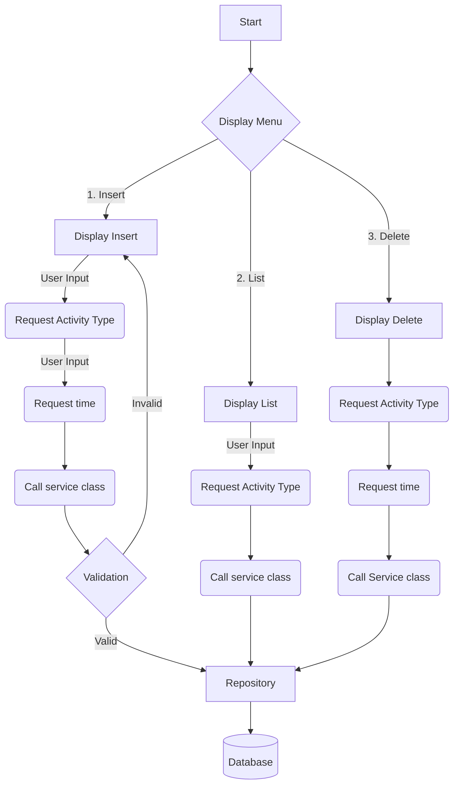
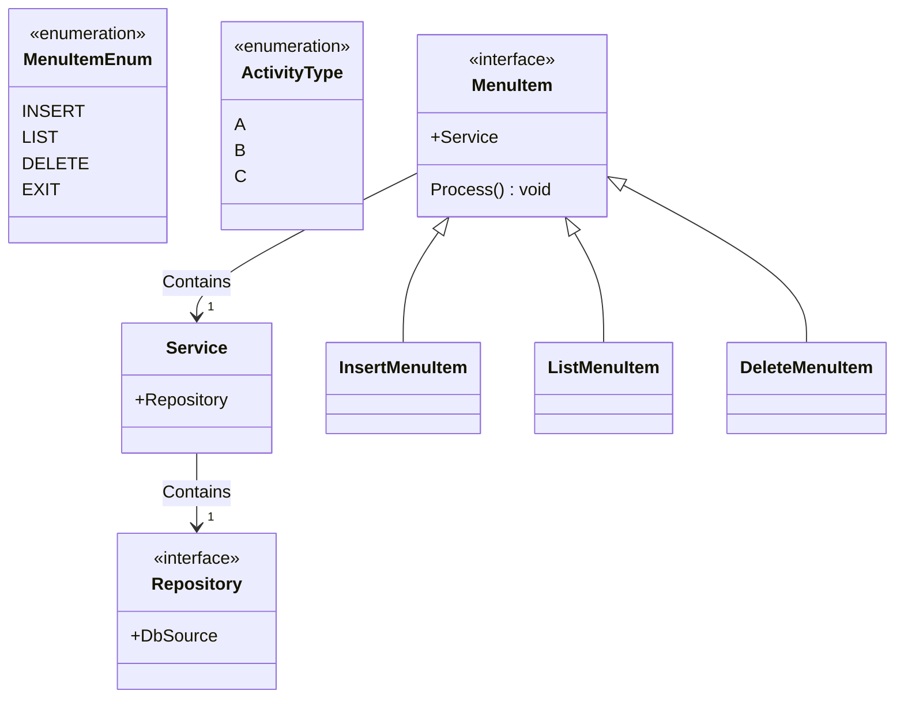

mermaid doc:
https://mermaid-js.github.io/mermaid/#/flowchart

## Flow chart

```mermaid
graph TD
    A[Start] 
    A --> C{Display Menu}
    C -->|1. Insert| Insert[Display Insert]
    C -->|2. List| List[Display List]
    C -->|3. Delete| Delete[Display Delete]

    Insert --User Input--> RAT(Request Activity Type)
    RAT --User Input-->RT(Request time)
    RT --> SI(Call service class)
    SI --> VI{Validation}
    VI --Valid--> R[Call Repository]
    VI --Invalid -->Insert
    
    List --User Input--> RAT2(Request Activity Type)
    RAT2 -->  SI2(Call service class)
    SI2 --> R

    Delete --> RAT3(Request Activity Type)
    RAT3 --> RT2(Request time)
    RT2 --> SI3(Call Service class)
    SI3 --> R

    R[Repository]

    R-->DB[(Database)]
  
```

## Class diagram

```mermaid
classDiagram
    class MenuItemEnum{
        <<enumeration>>
        INSERT
        LIST
        DELETE
        EXIT
    }
    class ActivityType{
        <<enumeration>>
        A
        B
        C
    }

    class Repository
    <<interface>>Repository
    Repository : +DbSource

    class Service
    Service: +Repository

    class MenuItem
    <<interface>>MenuItem
    MenuItem: +Service
    MenuItem: Process() void
  
    class InsertMenuItem
    MenuItem <|--InsertMenuItem
    MenuItem <|--ListMenuItem
    MenuItem <|--DeleteMenuItem

    MenuItem --> "1" Service : Contains
    Service --> "1" Repository: Contains
            
```
